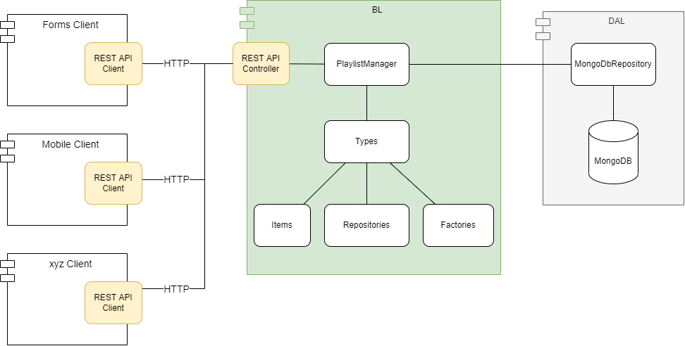

# WIFI PlaylistEditor Server

Database & REST API KnowHow:
[Create a web API with ASP.NET Core and MongoDB](https://learn.microsoft.com/en-us/aspnet/core/tutorials/first-mongo-app?view=aspnetcore-7.0&tabs=visual-studio)

Existing implementation with MongoDB.Driver
[Wifi.PlaylistEditor.Repositories.MongoDb](https://github.com/atillakati/SWDeveloper2019/tree/master/src/Wifi.PlaylistEditor.Repositories.MongoDb)

C# MongoDB Guide
[C# MongoDB Guide](https://rubikscode.net/2022/07/25/c-mongodb-guide)

ZetCode C# MongoDB tutorial
[C# MongoDB tutorial](https://zetcode.com/csharp/mongodb/)